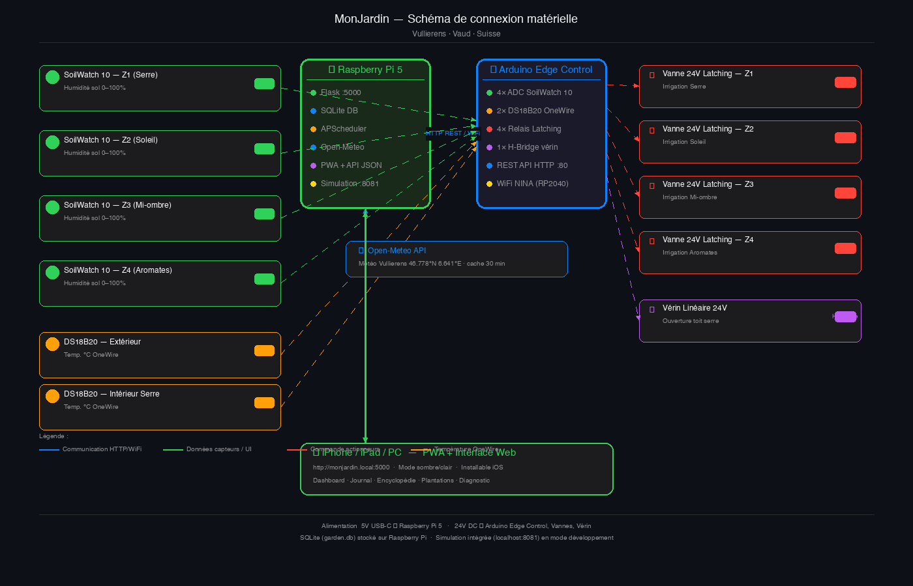

# 🌱 MonJardin — Version 1.0

Système automatisé de gestion de jardin potager · Raspberry Pi 5 + Arduino Edge Control · Flask · SQLite

---

## Aperçu visuel

### Tableau de bord


*4 cartes de zones avec humidité en temps réel, températures serre/extérieur, statut des vannes, plantations actives et prévisions météo horaires.*

### Page Conseils


*Carrousel de 12 conseils de jardinage, guide complet du compagnonnage (associations bénéfiques et à éviter), calendrier saisonnier.*

### Page Plantation


*Gestion des plantations par zone, conseils du mois (39 légumes en avril), progression et dates de récolte.*

### Diagnostic Arduino Edge Control


*Entrées analogiques SoilWatch 10, températures DS18B20, anémomètre, statut des vannes, vérin linéaire et I/O.*

### À propos


*Présentation du projet, fonctionnalités, matériel et stack technique.*

### Interface mobile iPhone (PWA)

<p align="center">
  
  &nbsp;&nbsp;
  
</p>

*Interface PWA installable sur iPhone — Tableau de bord et vue des zones avec barres d'humidité, plantations actives et contrôles.*


## Architecture matérielle



---

## Aperçu

MonJardin gère automatiquement l'arrosage et l'ouverture du toit de serre de 4 zones de culture, en tenant compte de l'humidité du sol, de la météo locale et des besoins spécifiques des légumes plantés.

| Zone | Nom | Particularité |
|------|-----|--------------|
| 1 | Serre | Toit motorisé, capteur température intérieure |
| 2 | Potager | Exposition plein sud |
| 3 | Potager | Exposition partielle |
| 4 | Fleurs | Seuils d'arrosage réduits |

---

## Architecture

```
MonJardin/
└── garden_manager/
    ├── run.py                  # Point d'entrée unique
    ├── app/                    # Application Flask
    │   ├── api/                # Routes HTML + API JSON
    │   ├── models/             # SQLAlchemy (Zone, SensorReading, Planting…)
    │   ├── services/           # Moteurs décisionnels + clients matériel
    │   ├── templates/          # Interface Jinja2
    │   └── static/             # CSS, JS, PWA assets
    ├── simulator/              # Émulateur Arduino (simulation physique)
    └── arduino_edge_control/   # Firmware C++ / PlatformIO
```

---

## Fonctionnalités

### Automatisation
- **Moteur d'arrosage** — décisions par zone selon humidité, météo, gel, canicule, fenêtres horaires
- **Moteur de toit** — ouverture/fermeture automatique (température, pluie, vent, nuit)
- **Conseils plantation** — compagnonnage, calendrier suisse, alertes incompatibilité
- **APScheduler** — cycles toutes les 60 secondes

### Interface web (PWA)
- Tableau de bord · Graphiques 30 jours · Journal des événements
- Encyclopédie de 50 légumes et fleurs (région suisse)
- Gestion des plantations par zone avec progression et récolte
- Page Conseils — carrousel, compagnonnage, calendrier saisonnier
- Diagnostic Arduino et Raspberry Pi en temps réel
- Paramètres du jardin configurables (nom, lieu, propriétaire)
- **Mode sombre/clair** · **Installable sur iPhone/iPad** (PWA)
- Sidebar rétractable · Menu hamburger mobile

### Météo
- Open-Meteo (`GARDEN_LATITUDE / GARDEN_LONGITUDE`)
- Cache DB 30 min · fallback simulateur

### Simulation
- Émulateur Arduino (`localhost:8081`) — physique réaliste par zone
- 6 profils météo (printemps, été chaud, orageux, automne, gel, canicule)
- Historique démo 30 jours généré automatiquement
- Accélération temps (`SIMULATION_SPEED`)

---

## Démarrage rapide

```bash
cd garden_manager
cp .env.example .env        # éditer si nécessaire
python -m venv venv && source venv/bin/activate
pip install -r requirements.txt
python run.py
```

Ouvrir **http://localhost:5000**

> En mode simulation (défaut), un émulateur Arduino démarre automatiquement sur `:8081`.

### Variables d'environnement clés

| Variable | Défaut | Description |
|----------|--------|-------------|
| `SIMULATION_MODE` | `true` | `false` pour vrai Arduino |
| `ARDUINO_API_URL` | `http://192.168.1.100:80/api` | IP de l'Arduino réel |
| `SIMULATION_SPEED` | `1` | Accélérateur de temps (ex: `60`) |
| `WEATHER_PROFILE` | `printemps_normal` | Profil météo simulé |
| `FLASK_PORT` | `5000` | Port de l'application |
| `GARDEN_NAME` | `MonJardin` | Nom affiché dans l'interface |
| `GARDEN_LOCATION` | `Vullierens · Vaud` | Lieu du jardin |
| `GARDEN_OWNER` | `Patrick Pinard` | Nom du propriétaire |

---

## Matériel

| Composant | Rôle |
|-----------|------|
| Raspberry Pi 5 | Serveur Flask, logique décisionnelle |
| Arduino Edge Control | Acquisition capteurs, pilotage actionneurs |
| SoilWatch 10 ×4 | Capteurs humidité sol |
| DS18B20 ×2 | Température extérieure + serre |
| Vannes 24V latching ×4 | Irrigation par zone |
| Vérin linéaire | Ouverture toit serre |

---

## Stack technique

- **Backend** : Python 3.10 · Flask · SQLAlchemy · APScheduler
- **Frontend** : Jinja2 · CSS custom (Apple design system) · Plotly.js · Bootstrap Icons
- **Base de données** : SQLite
- **Firmware** : C++ · PlatformIO · ArduinoJson
- **PWA** : Service Worker · Web App Manifest · iOS safe-area

---

*Version 1.0 · Avril 2026 · Patrick Pinard*
